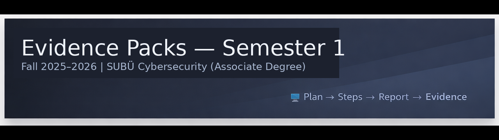
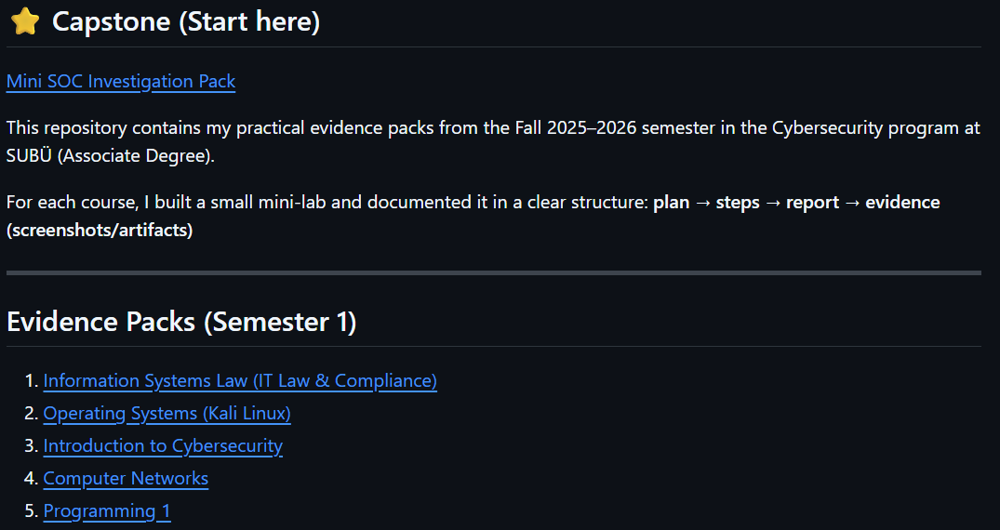

# Fall 2025–2026 — Evidence Packs (SUBÜ Cybersecurity)

This repository contains my practical evidence packs from the Fall 2025–2026 semester in the Cybersecurity program at SUBÜ (Associate Degree).

For each course, I built a small mini-lab and documented it in a clear structure:
**plan → steps → report → evidence (screenshots/artifacts)**

---

## Evidence Packs (Semester 1)

1) [Information Systems Law (IT Law & Compliance)](./01_Hukuk_GRC/)
2) [Operating Systems (Kali Linux)](./02_Isletim_Sistemleri/)
3) [Introduction to Cybersecurity](./03_Siber_Guvenlige_Giris/)
4) [Computer Networks](./04_Bilgisayar_Aglari/)
5) [Programming 1](./05_Programlama_1/)

---

## Semester Capstone (All 5 courses combined)

[Mini SOC Investigation Pack](./99_Semester_Capstone/)

A small incident-style case that combines OS logs + network observations + threat thinking + risk/controls + a simple script output.
